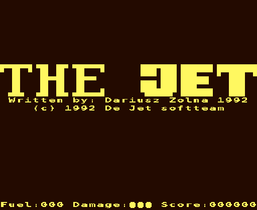
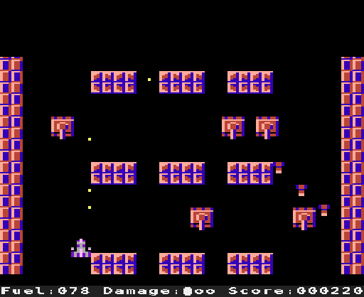

# The Jet (Atari 8-bit, 1992) — conversion pipeline

Clean reconstruction of Dariusz Zolna's *The Jet* as published in
**Tajemnice ATARI 6-7/92** (type-in hex listing). Goal: a faithful,
deterministic engine in Python and a pygame front end, the same method as
[Heartlight](https://github.com/Quaerendir/Heartlight) and
[FAC](https://github.com/Quaerendir/FAC).

Original game: Dariusz Zolna, (C) 1992 Tajemnice ATARI. Conversion
(extraction, disassembly, specification, engine, front end): **Quaerendir**.

A vertically scrolling shooter: the jet flies up an endless trench of
concrete you design yourself in a text editor. Shoot the soft walls, the fuel
tanks, the ammunition dumps and the repair stations, avoid the hard walls and
the tanks patrolling the trench and dropping shells. Three jets, fuel that
runs out, a six-digit score, no ending: the board wraps around.

 

## Files

| file | what |
|------|------|
| `6-7_92_thejet.html` | the magazine article with the listing and the sample board (source: unofficial TA archive, Pixel 2001) |
| `THEJET.LST`, `THEJET.COM`, `THEJET.PLA` | **the references**: the listing, the binary it encodes and the board, from `6-7_92.atr` in the archive's `6-7_92_listingi.zip` |
| `TheJet.bas`, `plansze.txt` | the listing and the board as text taken from the HTML; identical to the LST/PLA (checked by `tests/test_extract.py`) |
| `thejet_extract.py` | stage 1: decodes the hex DATA lines the way *Zgrywus* does, splits the DOS binary, writes the files below |
| `thejet.obj` | the 4157 bytes of the listing = `THEJET.COM` (JET.OBJ of the article) |
| `charset.bin`, `game.bin`, `text.bin` | the three segments: the character set ($2400), the code ($3000), the status line and title texts ($3E43) |
| `board.txt` | the sample board, 142 rows of 16, with a legend |
| `meta.json` | segments, memory map, source provenance |
| `JET.COM` | the playable file = binary + board, as the article's *Append* step makes it; byte-identical to the archive's |
| `thejet.xex` | the same game with the board embedded as a segment (`tools/build_xex.py --standalone`): loads with any loader or emulator |
| `thejet_disasm.py`, `game.asm` | stage 2: recursive-descent disassembler (py65) and the annotated disassembly of `game.bin` |
| `SPEC.md` | engine specification, every rule traced to a label in `game.asm` |
| `thejet/engine.py` | stage 3: the engine, a literal re-implementation of the main loop, `SCAN` and the VBI, with a cycle model of the code it runs |
| `thejet/render.py` | stage 4: the screen (ANTIC mode 4 with the fine scroll and the DLI cut, players and missiles, the mode-2 status line), the title screen, a four-channel POKEY model |
| `thejet/play.py` | stage 4: the playable game (`thejet` / `python -m thejet.play`): title, game, fade-out |
| `thejet/data/` | copies of `charset.bin`, `game.bin`, `text.bin`, `board.txt`, `meta.json` shipped inside the package |
| `tests/test_engine.py` | acceptance tests T1–T12 from `SPEC.md` §9 |
| `tests/test_original.py` | the engine against the original 6502 code running in py65, frame by frame, and its cycle counts |
| `tests/test_render.py`, `tests/test_play.py` | the renderer, the POKEY model and the front end's screens, headless |
| `tools/run_original.py` | boots `JET.COM` in py65 with a minimal OS model (the DOS loader's channel for `INIT`, VBIs, joystick, `RANDOM`) |
| `tools/build_xex.py` | builds `JET.COM` (article layout) or `thejet.xex` (standalone) |
| `tools/atari800_timing.py`, `tools/calibrate_timing.py` | the real cadence of the main loop and the calibration of the cycle model in libatari800 (cycle-exact, ANTIC DMA included) |
| `tools/screenshots.py`, `docs/*.png` | screenshots rendered from the extracted data |

## How the original works

Not a BASIC program this time: the listing is 320 lines of hexadecimal digits
that the magazine's *Zgrywus* utility writes verbatim to a file, JET.OBJ — a
DOS binary with a character set, 2.8 KB of 6502 code and the texts. The board
is a separate text file (16 characters per row, `#` hard wall, `"` soft wall,
`%` fuel, `$` ammunition dump, `!` repair, `<` `>` tanks) that the player
appends to it. The trick that makes the merged file work: the binary's INITAD
routine finds the IOCB the DOS loader is reading the file with, reads the rest
of the file — the board — through it, closes the channel and **falls straight
into the game**; it never returns to the loader, and RUNAD points at the same
place for form's sake. Any loader that does not keep a CIO channel open across
INITAD (emulators' built-in loaders, for instance) starts the game with no
board; `thejet.xex` is the same game with the board as a normal segment.

The screen memory is the game state: 24 rows of 32 characters in ANTIC mode
4 (narrow playfield, a board cell is 2×2 characters), the top two rows a
staging area where each new board row is written while the window scrolls
down through the memory one scanline at a time. Tanks, shells, splashes and
explosions are characters, animated by one pass over the memory per
iteration of the main loop — a pass whose in-place, forward-propagating
semantics (a shell dropped by a tank falls two pixels in the same pass; a
character not in the handler table makes the scan skip the next one) the
engine reproduces literally. The jet is two multicolour players, the shots
are the four missiles, and the vertical blank routine moves them, tests the
missiles against the character under them and the jet against the four
characters around it, counts the fuel down (one unit per 32 frames) and
writes the status line — with the OS character set, so a spare jet is the
letter `o` and a lost one the ball `●`: "Damage:ooo" becomes "Damage:o●●".
Every detail is in `SPEC.md`.

Three things the code does that the article does not say:

- **The tank rule.** A tank whose right neighbour cell is not empty is not
  placed at all (`LOAD_ROW`; the article warns instead that such a tank
  "erases the left half" of the neighbour). The sample board writes every
  left-facing tank as `<####`: none of its 30 tanks facing left ever appears,
  and the 26 facing right all do. What the player sees in their place is the
  staging rows' stale contents — the top half of the row below, twice.
- **Three frames per iteration.** The main loop waits for the vertical blank,
  scrolls, scans, and if the scan ran into the next frame it waits for the one
  after that. Even an empty board's scan costs 22 222 CPU cycles, about 900
  more than a PAL frame leaves after ANTIC's DMA, the DLIs and the vertical
  blank routines, so on real hardware **every iteration takes three frames**:
  the screen scrolls one scanline (two with the stick pushed up) every 60 ms,
  a tank moves 2 pixels in that time, and the second vertical blank of each
  iteration lands in the middle of the scan. Measured in libatari800 on four
  boards (`tools/atari800_timing.py`), reproduced by the engine's cycle model.
- **Your shots dig holes in hard walls.** A hit that registers in the top
  half of a hard-wall cell replaces the cell's bottom character with a splash,
  which animates and vanishes: the wall keeps a permanent gap one character
  wide and high.

## Verification

- `THEJET.LST` from the archive's disk image equals `TheJet.bas` line for
  line; the decoded DATA equal `THEJET.COM`; `plansze.txt` equals
  `THEJET.PLA`; the merged `JET.COM` equals the archive's (SHA-256 in
  `tests/test_extract.py`).
- `tools/run_original.py` runs the original code in py65: the DOS loader's
  channel and CIO for `INIT`, a vertical blank every PAL frame with the
  joystick, trigger and key shadows, `RANDOM` from a seeded generator, and —
  for the comparison — the option to fire the vertical blank exactly where
  the engine's cycle model put it inside the scan.
- `tests/test_original.py` plays the sample board and two tank boards with
  an autopilot for up to 1500 frames and compares the 800 bytes of screen
  memory, the 28 game variables, the 256 bytes of missile memory and the
  eight POKEY registers after **every frame**: identical, including the
  frames in which the vertical blank interrupts the scan half way. The
  engine's cycle counts of `SCROLL`, `SCAN` and the VBI are checked against
  py65's in the same test (within 40 cycles).
- `tools/calibrate_timing.py` runs the sample board without tanks in
  libatari800 (with the built-in AltirraOS; the tanks' shells are the only
  randomness) and in the engine under the same inputs: at the 464 frame ends
  of an 830-frame game at which neither side was in the middle of a scan, the
  screen memory and the variables were identical; the frame ends at which the
  emulator's scan was in progress gave the constants of `Timing` (SPEC §7).

## Usage

```
pip install pygame-ce
python3 -m thejet.play [--board FILE] [--scale 3] [--seed N] [--no-sound] [--no-title] [--os-font FILE]
```
Title screen: the trigger (Ctrl, Z, Return or a joystick button) — released,
then pressed, as the original wants. In game: left/right arrows or A/D steer,
up arrow or W doubles the scroll speed (the stick pushed up), the trigger
fires, **space pauses** (any direction resumes), **ESC gives up** (the
fade-out, then the title screen), Q quits. `--board` takes any board in the
article's format (`board.txt` is the article's; lines starting with `;` are
comments). The status line and the title screen use the Atari OS character
set, which is not part of this repository: pass `--os-font FILE` (a 1 KB
charset dump or an XL/OS-B ROM image, or set `THEJET_OS_FONT`) for a
pixel-exact rendering; without it the logo is drawn from the block graphics
it is made of (exactly) and the text from a system font.

```
python3 thejet_extract.py TheJet.bas plansze.txt --com JET.COM   # -> thejet.obj charset.bin game.bin text.bin board.txt meta.json JET.COM
python3 tools/build_xex.py --standalone                          # -> thejet.xex
pip install py65
python3 thejet_disasm.py thejet.obj > game.asm
python3 tools/run_original.py JET.COM --frames 600 --dump        # the original in py65
pip install pytest hypothesis mypy
python3 -m pytest -q          # 76 tests
python3 -m mypy thejet/       # strict
python3 tools/screenshots.py  # -> docs/*.png
```

```python
from thejet import Engine, Input, parse_board
e = Engine(parse_board(open('board.txt').read()))
events = e.tick(Input.of(right=True, fire=True))   # one PAL frame; e.mem, e.state, e.pokey
```

## Back to the Atari

`JET.COM` is the article's file and needs a DOS whose binary loader keeps
the file open while it calls INITAD (DOS 2.0/2.5 do). `thejet.xex` runs
anywhere. To play your own board on the Atari: `python3 tools/build_xex.py
--standalone --board myboard.txt -o myboard.xex`.

## Open items

- The three constants of the cycle model (`Timing`) are measured, not read
  from the code, and decide only at which character the vertical blank
  interrupts the scan (a few characters either way); the game's cadence does
  not depend on them.
- The magazine's two-letter line codes for this listing were not transcribed
  (the archive states its listings were verified with them).
- The sound is a POKEY model (64 kHz dividers, the 4/5/17-bit polynomial
  counters) fed with the registers the VBI writes; not compared with a
  recording.
- Not tested on real hardware.

## License

The conversion (extractor, disassembler, engine, front end, tests, spec) is
released under the MIT licence, see `LICENSE`. The original game and the
material derived from it (`THEJET.*`, `TheJet.bas`, `plansze.txt`, the
article, `thejet.obj`, `JET.COM`, `thejet.xex`, `game.bin`, `charset.bin`,
`text.bin`, `board.txt`, `game.asm`, screenshots) remain (C) 1992 Dariusz
Zolna / Tajemnice ATARI and are included for preservation and study only, see
`NOTICE`.
